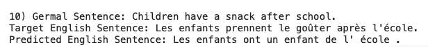
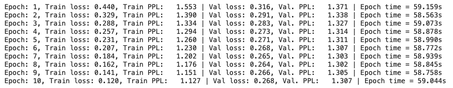

# Session10
The School of AI - END3 Course, Session 10 Assignment

*Group Members: Dhruba Adhikary, Phani Nandula, Prateek Maheshwari, Sujit Ojha*

## 1. Assignment :
Train the same code, but on different data. If you have n-classes, your accuracy MUST be more than 4 * 100 / n.

Submit the Github link, that includes your notebook with training logs, and proper readme file.  

Please remember that the objective of this assignment is to learn how to write code step by steps, so I should be seeing your exploration steps.

## 2. Results Summary

- Trained the model with tatoeba dataset  for 10 epochs [Notebook](Session10_END3_Transformer_Model_EN_FR_Translation_v1.ipynb). Model is for language translation from English to French.
- Sample Output

## 3. Dataset Summary (Ref: HuggingFace dataset)

Tatoeba is a collection of sentences and translations.

To load a language pair which isn't part of the config, all you need to do is specify the language code as pairs. You can find the valid pairs in Homepage section of Dataset Description: http://opus.nlpl.eu/Tatoeba.php E.g.

dataset = load_dataset("tatoeba", lang1="en", lang2="he")

## 4. Training Logs

